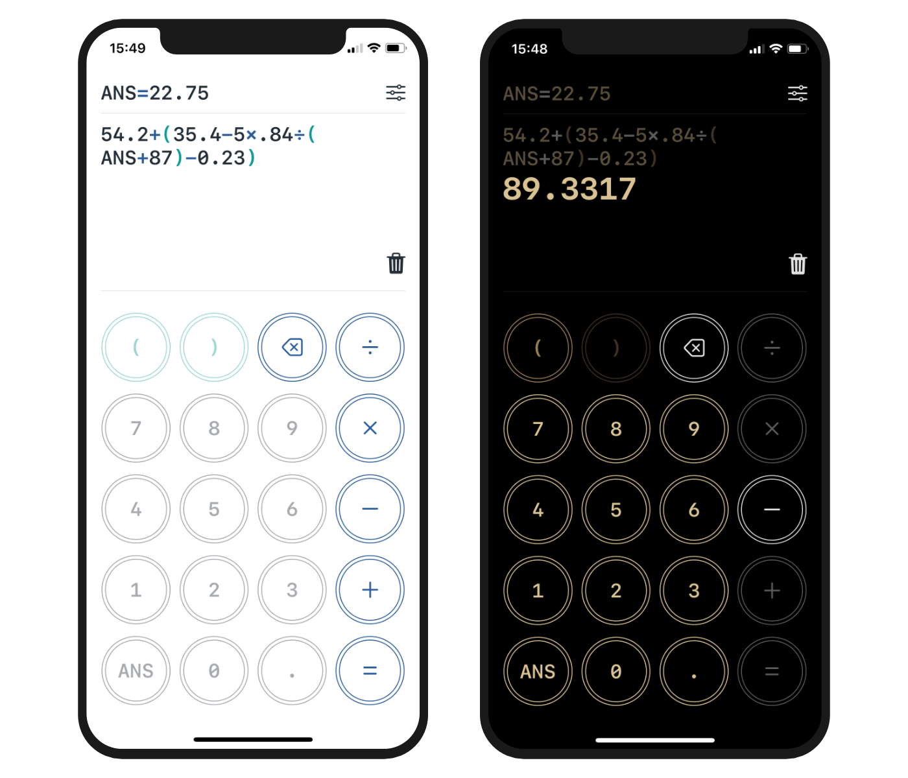

# **SwiftUI-Calculator**
A simple and elegant iOS calculator, developed with SwiftUI.

## **Author**
**Douglas Liu** \
GitHub: <https://github.com/DouglasLiuGamer>

## **Description**
This is a small project I built when I was learning SwiftUI. Since it is mostly for learning purpose, it is not designed to be a powerful calculator with numerous functionalities. But I did try to make it not *too simple* to lose the fun, so I spent many efforts on the UI/UX design.

*Nobody will pay for this*, not even myself, and I currently don't have an extra $99 for the Apple Developer Program, so I don't bother putting this on the AppStore. So right now, enjoy your visit :)

There will be a GitHub Pages introducing this app in a more detailed way in the future, and I will put the link here when I have done that.

## **Functionalities**

### **Full Equation Support**
This is a calculator that supports calculating a full equation. You can input a complete equation with operators, operants, result of the previous calculation and parentheses. The calculation will be performed based on the operator precedence.

### **Reactive UI Design**
The word "*reactive*" here largely refers to the dynamic button pads. Each button on the pad will react to your current equation, becoming disabled or not. This ensures that any equation you can enter *is* an equation that can be calculated.

### **Basic Setting**
You can change the numeric precision of floating-point results in the settings. Also, I add a vibration feedback on each button, you can disabled it if you don't like it.

### **Dark Mode Support**
This calculator has two color themes, which will react to the setting of your phone.

### **Localization**
This application supports both English and Chinese.

## **License**
This project is licensed under the MIT License.
